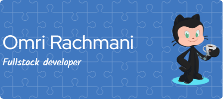

<!-- Centered & Full-Width Header -->

  

<h1 align="center">👋 Hi, I'm Omri Rachmani!</h1>
<h3 align="center">🚀 Full Stack Developer | AI & Simulation Enthusiast | DevOps & Cloud Practitioner</h3>

---

### 🌟 About Me  

I am a **Full Stack Developer** with **2+ years of experience**, passionate about **AI-driven applications, military simulations, and cloud-based technologies**. With a strong foundation in **Python (Flask, Django, LangChain, LLM Ops)** and **JavaScript/TypeScript (React, Node.js)**, I specialize in building **scalable, high-performance applications** for startups and defense projects.  

💡 I enjoy creating **AI-powered solutions**, **automating workflows**, and **developing real-time visualization tools**. My work includes **LLM integrations, GIS-based simulations, and DevOps pipelines**.

---

### 🛠 Tech Stack  

#### **🚀 Full Stack Development**

#### **🧠 AI & Machine Learning**

#### **☁️ Cloud & DevOps**

#### **🗺 GIS & Simulation**

---

### 🏆 Projects  

📌 **[AI-Powered Data Management System](https://github.com/omri1001/dca-webapp)** - Built using **React, TypeScript, Flask, LangChain, MongoDB, and Pinecone**.  
📌 **[Military Simulation Environment](https://github.com/omri1001)** - Developed GIS-based environments for **Unreal Engine & Bohemia Engine**.  
📌 **[LLM-Powered Telegram Bot](https://github.com/omri1001)** - Automates document generation with **GPT-4o, React Agents, and AWS**.  
📌 **[Real-Time News Scraper & AI Chat](https://github.com/omri1001)** - Integrated OpenAI’s LLM for **data-driven decision-making**.  
📌 **[Flight Deal Tracking System](https://github.com/omri1001)** - Automated alerts using **API calls, Pandas, and Google Sheets**.  

---

### 📊 GitHub Stats  

  
  

---

### 🌍 Let's Connect!  

📧 **Email:** Omrirahmani1001@gmail.com  
🔗 **LinkedIn:** [Omri Rachmani](https://www.linkedin.com/in/omri-rachmani-083106228/)  
🔗 **GitHub:** [omri1001](https://github.com/omri1001)  

---

⚡ *"Always learning, building, and pushing the boundaries of AI, cloud, and simulations."* 🚀
